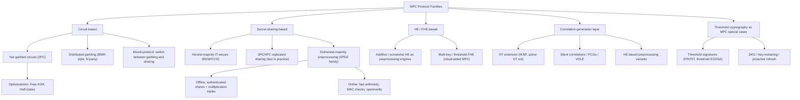
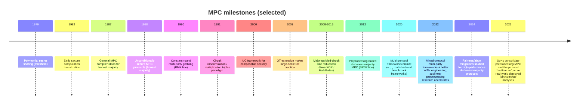

# Secure Multiparty Computation

## Executive summary

Secure multiparty computation (MPC) enables multiple mutually distrustful parties to compute a function of their private inputs such that (ideally) nothing is learned beyond what can be inferred from one’s own input and the prescribed output. This “cryptographic virtualization” of a trusted third party is the unifying lens behind most modern MPC definitions and protocol designs, from classic feasibility results in the 1980s to high-performance systems used in privacy-preserving analytics, advertising measurement, and threshold key management today.

Modern MPC practice is dominated by a small number of engineering paradigms:

- **Circuit-based protocols** (notably **Yao garbled circuits**) offer round-efficient secure computation for two parties; optimizations like **Free-XOR** and **Half-Gates** dramatically reduce communication per gate.  
- **Secret-sharing-based protocols** come in two major flavors: (a) **information-theoretic honest-majority MPC** (e.g., BGW/CCD) with strong unconditional security but scaling costs in the number of parties; and (b) **dishonest-majority preprocessing-based MPC** (notably the **SPDZ family**) with very fast online phases but complex and expensive offline (preprocessing) phases.  
- **Oblivious transfer (OT)** and related correlation-generation primitives are central *performance levers*: OT extension made large-scale 2PC plausible, while newer “silent” correlation techniques aim to make preprocessing sublinear in communication.  
- **Security notions** (semi-honest vs. malicious vs. covert; fairness vs. abort; UC composability) are not just theory: they directly translate into latency, bandwidth, and the operational risk profile of real deployments. In particular, many high-performance protocols in the dishonest-majority setting provide **security-with-abort** rather than fairness or guaranteed output delivery.

In open-source and commercial ecosystems, frameworks such as **MP-SPDZ**, **SCALE-MAMBA**, **Sharemind**, **ABY**, and **EMP-toolkit** exemplify the “compiler + optimized protocol backend” pattern that makes MPC usable by non-cryptographers, while newer systems such as **MOTION** and **CrypTen** target mixed-protocol MPC and machine-learning workflows specifically.

## Definitions and core goals

At its core, MPC addresses the following problem: parties \(P_1,\dots,P_n\) holding private inputs \(x_1,\dots,x_n\) want to compute \(f(x_1,\dots,x_n)\) while controlling what each party learns during and after the computation. Early formalizations already emphasize that protocol design must simultaneously address **privacy** (input confidentiality), **correctness** (right output when honest), and **cheating prevention**, often framed against an “ideal trusted party” baseline.

A widely used modern formulation is **simulation-based security in the real/ideal paradigm**: a real-world protocol execution is “secure” if whatever an adversary can achieve in the real protocol can be simulated in an ideal execution where a trusted functionality computes \(f\) and returns outputs. This supports precise statements of “leaks nothing but the output,” including nuanced leakage through outputs themselves (i.e., the output intrinsically reveals some information about inputs unless \(f\) is trivial).

Core goals typically include:

- **Input privacy / confidentiality:** adversaries should not learn extra information about honest parties’ private inputs beyond what follows from their own inputs and specified outputs.  
- **Correctness / integrity:** adversaries should not be able to force an incorrect output without detection (depending on the model, this may allow abort).  
- **Robustness / availability properties:** “What happens if someone misbehaves or disconnects?” This is where **security-with-abort**, **fairness**, and **guaranteed output delivery** diverge and become operationally important.  
- **Composability:** protocols are rarely used in isolation; security should survive composition in larger systems and concurrent settings (motivating UC and related frameworks).  

A practical “systems” view adds further goals that are often as constraining as cryptographic security itself: high throughput for arithmetic (linear algebra), predictable latency under WAN conditions, constant-time behavior to avoid side channels, and developer ergonomics via higher-level languages and compilers.

## Threat models and security notions

### Adversary behaviors: semi-honest, malicious, covert

Most MPC literature and implementations distinguish threat models based on how corrupted parties behave:

**Semi-honest (a.k.a. passive, honest-but-curious).** Corrupted parties follow the protocol but attempt to learn additional information from the transcript. This model is often the “baseline” for efficiency; many frameworks offer semi-honest configurations because they are noticeably faster and simpler than fully malicious security.

**Malicious (a.k.a. active, Byzantine).** Corrupted parties may deviate arbitrarily from the protocol to learn secrets or bias outputs. Achieving active security generally requires additional consistency checks (e.g., message authentication on shares, cut-and-choose, zero-knowledge proofs), which adds communication, computation, and/or rounds.

**Covert adversaries.** A middle-ground notion: the adversary may cheat but wants to avoid being detected with significant probability. The goal is to deter cheating by imposing a detectable “risk,” often yielding protocols more efficient than fully malicious security while more realistic than purely passive assumptions for some commercial settings.

### Corruption structure: threshold, honest majority, dishonest majority

Security and efficiency hinge on how many parties may be corrupted and whether an honest majority is assumed.

- In classic **information-theoretic honest-majority MPC**, thresholds like \(t < n/3\) arise for Byzantine-resilient protocols (with variants for passive security), and protocols often rely on secret sharing with information-theoretic guarantees.  
- In **dishonest-majority** settings (including 2-party computation), protocols typically rely on computational assumptions and heavier cryptographic machinery. Modern “SPDZ-like” preprocessing protocols aim to retain strong privacy even if all but one party is malicious (maximum corruption \(t=n-1\)), often at the cost of only achieving security-with-abort.  

### Output delivery, fairness, abort

Three closely related notions matter both theoretically and operationally:

- **Security with abort:** a malicious party can force the protocol to abort; privacy of honest parties is still preserved, but honest parties may receive no output. This is common in high-performance dishonest-majority MPC and is explicitly noted for SPDZ-family protocols in practice.  
- **Fairness:** either everyone learns the output or no one does. In many settings (notably dishonest-majority general MPC), fairness is provably unattainable for general functionalities, motivating partial notions and hybrid mitigations.  
- **Guaranteed Output Delivery (G.O.D.):** all honest parties obtain output regardless of adversary behavior (stronger availability). The relationship between fairness and guaranteed output delivery depends on the setting and functionality, and has been studied explicitly.  

Recent work continues to address real-world consequences of abort: for example, analyses of SPDZ highlight that a cheating party can potentially “steal” outputs by forcing abort after learning them, and propose hybrid adaptations that recover fairness under additional assumptions (e.g., fewer than half corrupt).

### UC security and composability

The **Universal Composability (UC)** framework formalizes security in a way that is preserved under arbitrary composition, including concurrent protocol executions. In UC, protocols are proven to emulate ideal functionalities even in adversarially controlled environments with many interacting protocol instances.

Practically, UC (and related composable notions) becomes important when MPC is embedded as a component in larger systems (e.g., threshold key-management pipelines, privacy-preserving data collaborations, or multi-step workflows over time). Deployments that run repeated MPC sessions, handle failures, rotate participants, or integrate with network authentication often inherit subtle composition risks if the underlying guarantees are only “standalone.”

## Main protocol families and taxonomy

### Taxonomy diagram

The following taxonomy is a pragmatic “systems” classification: protocol families are grouped by their dominant technique for representing and evaluating \(f\) (circuits and garbling, secret sharing, homomorphic encryption) and by how they obtain expensive correlated randomness (OT/VOLE/PCGs, HE-based preprocessing, etc.).

### Key milestones timeline

Below is a compact milestone timeline. It mixes “theory milestones” (feasibility and security frameworks) with “engineering milestones” (primitives and optimizations that materially changed performance and adoption).

### Family notes: what distinguishes each approach

**Yao garbled circuits (GC).** Originally introduced in early secure computation work, GC evaluates a Boolean circuit by “garbling” gate truth tables so that an evaluator can compute only with encoded wire labels. A key performance property is that communication depends mainly on the number and type of gates, not on circuit depth (rounds are essentially constant after input transfer via OT), making GC attractive over high-latency links.

**GMW-style protocols.** GMW evaluates Boolean circuits using secret sharing (often XOR-sharing) and uses OT to compute AND gates. Compared with GC, GMW tends to have smaller per-gate communication in some regimes but requires interaction proportional to circuit depth, which can be limiting on high-latency networks.

**BGW/CCD (information-theoretic honest-majority).** These classic MPC protocols show that essentially any functionality can be computed with unconditional security given pairwise secure channels and an honest majority; they rely on secret sharing and collective consistency procedures. Thresholds such as tolerating up to \(t < n/3\) Byzantine faults are fundamental in these models.

**SPDZ family (dishonest-majority, preprocessing model).** SPDZ-style protocols separate work into:  
(1) an **offline/preprocessing phase** that generates authenticated secret-shared randomness (including multiplication triples), typically independent of actual inputs; and  
(2) an **online phase** that evaluates arithmetic circuits quickly using the preprocessed material plus integrity checks (e.g., MAC checks). This yields strong privacy even under maximum corruption but often only **security with abort**.

**HE / (multi-key) FHE-based MPC.** Homomorphic encryption enables computation on ciphertexts, sometimes with minimal interaction. Multi-key FHE aims to allow evaluation over ciphertexts encrypted under different keys, with joint decryption; it is often framed as “cloud-aided MPC.” In practice, HE/FHE is frequently used in *hybrid* constructions (e.g., join + aggregate) rather than as a universal replacement for secret-sharing MPC for all workloads.

**Threshold cryptography.** Many threshold primitives—distributed key generation (DKG), threshold signing, proactive refresh—can be viewed as specialized MPC with strong correctness and robustness requirements. Standards such as FROST highlight the intersection of MPC techniques with protocol standardization and deployment constraints (round count, identifiable abort, etc.).

## Performance metrics and engineering cost model

A rigorous performance discussion separates **asymptotics** (big-O in parties \(n\), security parameter \(\kappa\), and circuit size) from **concrete costs** (bytes transferred, crypto operations, latency sensitivity, and offline/online splits). Modern MPC papers and systems increasingly report cost both by phase and by gate type because real workloads are dominated by specific operations (matrix multiplications, comparisons, bit-decompositions, etc.).

### Core metrics

**Communication complexity.** Often measured (a) asymptotically per gate/operation and (b) concretely in bytes. Communication is typically the dominant bottleneck in WAN settings; protocols such as garbled circuits are attractive partly because their number of rounds is small (latency-friendly), while GMW-like approaches can be bandwidth-efficient but latency-sensitive due to depth-dependent interaction.

**Computation complexity.** Encompasses local cryptographic operations (hashing, symmetric crypto, OT/HE operations, MAC checks) and algebraic operations over fields/rings. Many systems emphasize vectorization and batching to amortize fixed costs.

**Round complexity.** The number of back-and-forth message exchanges matters greatly over high-latency networks. Classic results: BGW/CCD and GMW are depth-dependent, whereas BMR and Yao-style GC are constant-round (after setup/OT).

**Preprocessing vs. online phase.** In preprocessing-based protocols (notably SPDZ-like), the offline phase produces correlated authenticated randomness; the online phase consumes it for fast evaluation. Offline/online splits allow “input-independent” work to be done ahead of time and sometimes traded against storage.

### Why offline/online matters in practice

SPDZ-style protocols explicitly structure the workflow around offline generation of authenticated shares and multiplication triples, then online evaluation where additions are local (due to linearity) and multiplications require interaction plus integrity checks (MAC validation). This design is central to why SPDZ-like protocols are widely used in high-assurance dishonest-majority settings despite complex setup: **it makes the online cost close to an “information-theoretic” evaluation** once the authenticated randomness exists.

This leads to concrete system design questions that appear repeatedly in real deployments and benchmarking frameworks:

- How much offline material is needed for a given computation, and can it be generated fast enough (or amortized across runs)?  
- Can offline communication be made sublinear (e.g., via pseudorandom correlation generators / silent preprocessing) so that generating triples is no longer bandwidth-dominant?  
- How does protocol choice depend on the network regime (LAN vs WAN, low bandwidth vs high latency)? Mixed-protocol frameworks often incorporate engineering decisions (serialization, batching) and provide explicit guidance/benchmarks.  

## Concrete protocol comparisons and notable implementations

### Comparison table (representative families)

The table below provides a graduate-level, engineering-oriented comparison. Complexity entries are intentionally given at the “dominant term” level; concrete costs vary heavily by optimizations (e.g., Free-XOR/Half-Gates in GC), compilation strategy, and workload (arithmetic vs Boolean circuits).

| Family / representative protocol | Security model (typical) | Trust assumptions | Communication complexity (dominant) | Computation complexity (dominant) | Round complexity | Preprocessing needs | Typical use cases | Notable implementations / libraries |
|---|---|---|---|---|---|---|---|---|
| Yao garbled circuits (2PC) | Semi-honest common; malicious via extra checks | No honest majority; relies on cryptographic assumptions + OT | ~linear in non-XOR gates; optimizations reduce ciphertexts per gate | Garbling + symmetric crypto + OT | Constant rounds after setup/OT | OT (often OT extension) | 2-party private analytics, comparisons, PSI-like building blocks | EMP-toolkit; ABY; MP-SPDZ supports GC; many GC-based systems |
| GMW (Boolean / arithmetic sharing with OT) | Often semi-honest; malicious via heavier tooling | Usually honest majority for some variants; dishonest majority possible but costlier | ~linear in AND gates (OT-based) and sensitive to circuit depth | Local XOR/linear ops + OT for AND/mults | ~linear in circuit depth | OT extension is key to scale | Depth-optimized circuits; settings where bandwidth is tight but latency is small | MOTION implements GMW variants; MP-SPDZ supports GMW-style backends |
| BGW/CCD (classic IT-secure honest-majority MPC) | Information-theoretic privacy; Byzantine-resilient variants | Honest majority; pairwise authenticated secure channels | Per multiplication at least quadratic in parties in many instantiations; depth-dependent | Field arithmetic + consistency checks | Depth-dependent | None required (can be improved with preprocessing) | Small–moderate \(n\) consortium computations where unconditional security and honest majority are realistic | Implemented (as variants) in several academic frameworks; MP-SPDZ includes honest-majority modes |
| BMR (distributed garbling, N-party) | Typically semi-honest; active variants exist with added cost | Often targets \(t<n\) in some regimes; depends on construction | ~linear in circuit size; can be competitive in high-latency settings | Distributed garbling overhead + correlated OT | Constant (depth-independent) | Significant preprocessing/correlation generation | N-party secure evaluation in high-latency networks; mixed-protocol conversions | MOTION includes OT-based BMR; MP-SPDZ supports BMR-style protocols in some configurations |
| SPDZ family (dishonest majority, preprocessing model) | Malicious security **with abort** is common; some covert/hybrid variants | No honest majority required (can tolerate \(t=n-1\)) | Offline dominates; online per multiplication involves openings + MAC checks; often broadcast-style costs | Offline: heavy crypto (HE/OT/VOLE/PCGs); online: mostly field ops + MAC checks | Online: low constant rounds per multiplication layer; depth matters but batches help | **Requires** offline authenticated randomness and triples | High-assurance multi-party analytics; PPML arithmetic-heavy workloads | MP-SPDZ; SCALE-MAMBA; many protocol “engines” (MASCOT, Overdrive, LowGear 2.0) |
| Replicated secret sharing (fast 3PC/4PC honest-majority) | Often semi-honest for best performance; malicious variants exist | Typically honest majority (e.g., 1 corruption in 3PC) | Very low per-gate communication possible; highly workload-dependent | Efficient arithmetic + conversions for non-linear ops | Very low rounds per layer; practical speed | Optional/preferable preprocessing for some ops | Data-center MP computations, PPML inference/training with few non-colluding servers | Sharemind’s backend emphasizes 3-party honest-majority; MP-SPDZ reports strong performance for replicated 3-party modes |
| HE-based join/aggregate (hybrid HE + PSI paradigms) | Typically semi-honest or model-specific; varies by design | Often 2-party, no honest majority; assumes hardness of HE scheme | Often low interaction; comm dominated by ciphertext sizes + key material | HE ops dominate; packing can help | Often few rounds | Key generation; sometimes preprocessing to amortize | Private database joins, measurement/attribution aggregates | “Private Join and Compute” line of work; built for deployed join-and-aggregate workflows |
| Multi-key / threshold FHE (cloud-aided MPC) | Depends on scheme; typically computational security | Multiple key holders + joint decryption | Can be low-round for evaluation; decryption often interactive | FHE costs dominate (bootstrapping if needed) | Often low online interaction, but joint decrypt required | Key setup + key-switching material | Outsourced computation where data owners retain keys; cross-key evaluation | Implemented via HE libraries + protocols; see multi-key FHE literature and modern HE stacks |
| Threshold signatures (e.g., FROST; threshold ECDSA) | Typically malicious-resistant; identifiable abort often desired | Threshold assumption: at least \(t\) honest shares required | Depends on scheme; designed to minimize rounds and bandwidth | Group ops + ZK proofs depending on scheme | FROST signing is 2 rounds (standardized) | DKG and key refresh are separate costs | Key management, custody, distributed authorization | Standardized FROST (RFC); open-source threshold ECDSA stacks (tss-lib, multi-party-ecdsa) |
| OT/VOLE/PCG-based preprocessing (correlation generation layer) | Security varies (semi-honest → malicious) | Assumptions depend (RO model, LPN/LWR variants, etc.) | Goal: sublinear/offline-efficient correlation seeds; reduces bandwidth bottlenecks | Mostly symmetric crypto + linear algebra + consistency checks | Often 1–2 round setup goals | Produces OT correlations / triples / other correlations | Accelerating preprocessing for large MPC jobs | Silent OT extension; VOLE-based OT; sublinear multiparty triple generation for SPDZ |

### Notable open-source frameworks and what they emphasize

**MP-SPDZ** positions itself as a “multi-protocol benchmark and programming platform,” explicitly spanning honest/dishonest majority and passive/active corruption, and combining secret sharing, homomorphic encryption, and garbled circuits within a unified toolchain. Its official documentation frames MPC as a “black box” operating on private data, and its repository emphasizes breadth of supported security models.

**SCALE-MAMBA** is an MPC software system historically rooted in the SPDZ line; the official project page documents its protocol lineage (BDOZ/SPDZ/TinyOT/HSS) and also notes that active maintenance ceased around mid-2022. This matters operationally when choosing between actively maintained stacks versus historically influential ones.

**Sharemind** presents itself as an MPC platform with an application-development story: programs are written in the open-source SecreC language, which marks private vs public data flows so developers need not manage protocol details directly. Public materials describe deployments at government scale (e.g., analyses over millions of tax records and hundreds of thousands of education records) and emphasize that data is encrypted at the source and not present unencrypted outside the data owner.

**ABY** is a mixed-protocol 2PC framework combining arithmetic sharing, Boolean sharing, and Yao GC, with efficient conversions enabled by OT extension. Its paper explicitly argues for protocol “mix-and-match” to optimize for specific subcomputations.

**EMP-toolkit** is a collection of libraries for efficient 2PC, including semi-honest and malicious variants (across subprojects). It is widely used as a practical GC/2PC baseline in systems work.

**MOTION** is an open-source mixed-protocol multi-party framework that explicitly targets adoption and provides engineering features (e.g., communication serialization) and optimized instantiations of GMW and OT-based BMR, reporting large speedups over prior baselines in various network regimes.

**CrypTen** is a secure MPC framework aimed at machine-learning abstractions (tensors, autodiff, neural networks) and leverages GPU acceleration and high-performance communication libraries; its published evaluation focuses on ML training/inference usability and performance.

## Practical deployments and industry use-cases

Publicly documented MPC deployments and MPC-derived protocols are increasingly visible, but “full general-purpose MPC at scale” remains less common than specialized MPC-like tasks such as private set intersection, privacy-preserving joins, private measurement, and threshold key operations.

### Advertising measurement, private joins, and aggregate analytics

**Private Join and Compute (PJC).** PJC is a two-party paradigm proposed and deployed by Google to support join-and-aggregate computations (e.g., ad conversion measurement) by combining private set intersection ideas with homomorphic-encryption-style aggregation. Public academic analyses connect PJC to prior deployed PSI-sum protocols and provide formal/empirical evaluation of its behavior and leakage.

**Private Computation Framework (PCF).** Meta has released an open-source “private computation framework” library intended for privacy-preserving randomized controlled trials and advertising lift measurement using secure multiparty computation, emphasizing aggregate statistics without individual-level sharing.

These examples illustrate a broader pattern: practical deployments often focus on *structured* functionalities (joins, sums, aggregates, A/B metrics) where the functionality can be tightly engineered, and where leakage profiles can be reasoned about more concretely than for arbitrary programs.

### Consumer security features via PSI-like protocols

Apple documents use of a private set intersection protocol in its Password Monitoring feature, describing how the device and server compute PSI-related information while limiting server knowledge about the user’s password to a bucket prefix and blinding factors.

This is a representative “MPC adjacent” pattern: PSI is a specialized secure computation primitive that is often deployed more readily than general-purpose MPC because it has a narrow performance envelope and a well-defined output.

### Government and statistical analytics with MPC platforms

Public presentations and documentation report that Cybernetica’s Sharemind platform has been used by government agencies and data owners to conduct privacy-preserving studies over large datasets (e.g., millions of tax records and hundreds of thousands of education records), with the workflow emphasizing encryption at source and secure analysis by authorized statisticians.

The public story here is notable because it demonstrates that MPC can be integrated into institutional workflows (data import, permitted query plans, analyst tools) rather than being a one-off cryptographic demo—an adoption path that many purely academic MPC prototypes lack.

### Threshold cryptography in custody and distributed authorization

Threshold signatures and distributed key management are among the clearest “industry pull” areas for MPC techniques. Standardization of threshold Schnorr signing in **FROST** (RFC 9591) highlights a push toward interoperable, deployment-friendly protocols with explicit round complexity (two-round signing) and robustness considerations.

Open-source implementations for threshold ECDSA also exist (for example, multi-party threshold ECDSA libraries and widely used tooling), and the research literature continues to propose protocols with strong guarantees such as identifiable abort and UC-style analyses for distributed ECDSA.

## Recent advances, attack vectors, and recommended reading

### Recent advances and notable papers from the last five years

The last five years (roughly 2021–2026) show a clear shift from “new feasibility constructions” to **performance systematizations**, **preprocessing/communication reductions**, and **application-focused protocols/frameworks**.

**Systematizations and guidance.** Two recent SoKs exemplify the consolidation trend: one focuses specifically on **MPC in the preprocessing model** (organizing the rapidly growing body of offline/online triple-generation and correlated randomness techniques), and another targets the broader “multiverse” of MPC protocol performance and selection guidance.

**Mixed-protocol and usability-driven engineering.** The MOTION framework paper highlights engineering choices (serialization, optimized correlated OT) and provides empirical claims of competitiveness for OT-based BMR and mixed protocols, arguing that multi-party garbling can be more practical than previously believed in some regimes.

**Preprocessing and bandwidth reductions for dishonest-majority MPC.** A cluster of work aims to reduce offline cost (especially communication) for SPDZ-like protocols:
- Low-communication multiparty triple generation using correlation generators (PCG-style approaches) designed to compress correlated randomness into smaller seeds.  
- Protocol refinements such as Overdrive LowGear 2.0 that explicitly target reduced bandwidth and round complexity for triple generation and report concrete bandwidth savings over prior approaches.  
- New dishonest-majority protocols over \(\mathbb{Z}_{2^k}\) (important for 64-bit integer-like computation) that claim substantial communication reductions versus prior SPDZ-like approaches in specific settings.  

**Closer scrutiny of fairness/security-with-abort gaps.** Work explicitly analyzing SPDZ’s security-with-abort limitation and proposing hybrid fairness improvements indicates that availability and “output stealing” are no longer purely theoretical concerns, but practical issues for real deployments.

**Application-driven MPC research.** Machine learning continues to drive protocol engineering, with frameworks (e.g., CrypTen) emphasizing tensor-level abstractions and GPU acceleration for privacy-preserving ML workflows, and with systems papers integrating MPC into end-to-end ML pipelines.

**Threshold cryptography improvements and standardization.** Standardization of FROST (RFC 9591) anchors a practical threshold signing design in a widely deployed ecosystem. In parallel, threshold ECDSA research continues to seek fewer rounds and stronger composability/abort properties, with recent papers explicitly framing UC-style guarantees and identifiable abort for distributed ECDSA.

### Attack vectors and failure modes in practice

MPC security can fail through three broad classes of issues: (1) **model mismatch** (the deployed threat differs from the proved one), (2) **cryptographic proof/assumption gaps**, and (3) **implementation/operational leakage**.

**Model mismatch and abort semantics.** Many high-performance protocols in the dishonest-majority setting provide security-with-abort; if an application implicitly assumes fairness or guaranteed output delivery, an adversary can exploit that mismatch operationally (e.g., abort after learning output). This is not hypothetical—SPDZ-focused work highlights precisely this risk and motivates mitigations.

**Proof gaps and subtle cryptographic breakpoints.** A concrete example: the widely actively secure OT extension line includes an explicit note that a key lemma in a prior proof was found incorrect, motivating repaired variants and showing that “standard building blocks” can have evolving proof status. This matters because OT extension is deeply embedded in many MPC protocols and implementations.

**Protocol-level attacks on optimized constructions.** Garbled circuit schemes have numerous optimizations; recent work demonstrates attacks and fixes on certain deterministic-encryption-based garbling variants, especially impactful when combined with Free-XOR, illustrating that composition of optimizations can create new attack surfaces if assumptions are violated.

**Threshold-crypto fragility and leakage.** Practical threshold signature protocols are security-critical and have been subject to public scrutiny; for instance, analyses report information disclosure attacks against variants of well-known threshold ECDSA constructions. This highlights that “MPC as key management” must treat cryptographic reviews and side-channel robustness as first-class concerns.

**Implementation and operational side channels.** Even with strong cryptographic proofs, secure computation can leak through system channels: timing, memory access patterns, compiler transformations, or compromised endpoints. Practical guidance documents on actively secure 2PC emphasize that in realistic threat models (e.g., one compromised host), organizational and deployment measures (separate providers, auditing, authenticated channels) complement cryptography, and that abort-on-cheating is often the realistic integrity guarantee.

### Open research challenges

The field’s open challenges cluster around “closing the gap” between strong security goals and practical deployment constraints.

**Communication-efficient malicious MPC at scale.** Malicious security remains significantly more expensive than semi-honest in many regimes; a major line of work targets reducing preprocessing communication (sublinear or “silent” preprocessing) while retaining strong active security.

**Fairness and availability under dishonest majority.** Fundamental impossibility results constrain fairness in general settings, but real applications frequently need stronger availability semantics than “abort.” Designing deployable mitigations—hybrid models, identifiable abort, penalties, or protocol-level fairness improvements—remains a key challenge.

**Protocol selection guidance and reproducible benchmarking.** The proliferation of protocols and parameter choices makes “which protocol should I use?” a hard question; recent SoKs explicitly call out lack of guidance as a barrier and emphasize comparative metrics and systematic evaluation.

**Secure computation for ML at modern model scales.** PPML workloads stress MPC with large matrix multiplications and non-linearities; systems increasingly rely on mixed-protocol designs (arithmetic sharing for linear algebra, garbling for comparisons/activations) and specialized compilers, yet end-to-end efficiency for very large neural models remains challenging.

**Robust engineering against side channels and endpoint compromise.** Practical reports emphasize that cryptographic security alone does not protect against fully compromised endpoints on both sides; deployment isolation, auditing, and safe I/O handling are necessary, and constant-time / leakage-aware implementations remain hard—especially in mixed CPU/GPU stacks.

### Recommended reading prioritized by primary sources

The list below is prioritized toward original papers, official documentation, and primary technical reports. (Citations are the “links.”)

**Foundational and definitional**
- “Protocols for Secure Computations” (early secure computation formulation and motivating examples).  
- “How to Play Any Mental Game” (classic general MPC compiler line; GMW lineage).  
- BGW and CCD foundational honest-majority protocols (unconditional security and threshold phenomena).  
- UC framework paper (why composability matters; formalizing secure protocol composition).  
- Covert adversary model introduction and definitions (bridging semi-honest and malicious).  

**Engineering primitives that changed practice**
- OT extension (IKNP-style) as a scaling milestone for OT-heavy MPC.  
- Free-XOR and Half-Gates for garbled circuits (key concrete-size reductions).  
- Circuit randomization / multiplication triples paradigm (why arithmetic MPC can be fast online).  

**SPDZ line and preprocessing MPC**
- SPDZ “somewhat homomorphic encryption + preprocessing model” line (foundational SPDZ paper metadata and venue).  
- MASCOT (OT-based preprocessing for SPDZ-style protocols; explicit offline/online decomposition).  
- Overdrive and subsequent offline-phase refinements (HE-vs-OT tradeoffs in preprocessing).  
- SoK: Multiparty Computation in the Preprocessing Model (primary consolidation of preprocessing techniques).  

**Frameworks and “how to actually build things”**
- MP-SPDZ paper and official documentation (multi-backend benchmark framework; practical programming interface).  
- SCALE-MAMBA official project page and repository (historical SPDZ ecosystem and documentation pointers).  
- ABY (mixed-protocol 2PC framework, OT-based conversions).  
- MOTION (mixed-protocol multi-party framework; GMW + BMR).  
- Actively-secure 2PC survey/report with framework mapping and operational considerations.  

**Recent (2021–2026) advances worth reading**
- Low-communication multiparty triple generation for SPDZ from Ring-LPN (PCG-style compression for preprocessing).  
- Overdrive LowGear 2.0 and Multipars (recent bandwidth/communication reductions for dishonest-majority arithmetic MPC).  
- Extending the Security of SPDZ with Fairness (explicitly targets abort/fairness gap).  
- Private Join and Compute in the Real World (deployment-oriented join/compute analysis).  
- SoK: Demystifying the multiverse of MPC protocols (performance-focused guidance).  
- FROST (RFC 9591) for standardized threshold signing; UC distributed ECDSA line for stronger composability/abort properties.